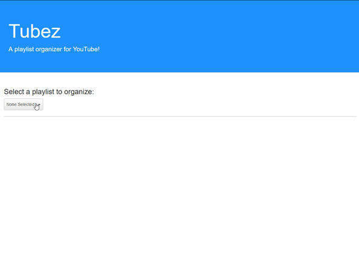

Tubez is a playlist organizer for Youtube that allows you to bulk copy, move, and delete videos in each of your playlists. Did you save all your YouTube videos into a single, unorganized playlist? Now you can move them into their own, well-organized, playlists quickly and easily with Tubez!

## Features

- Copy, move and delete videos in any of your playlists
- Switch between playlists easily with the provided dropdown menu
- Select multiple videos at once with the provided checkboxes

## Gaining Access

Currently, Tubez can only be accessed by **approved testers**.

If you would like to try out Tubez, email me at [rbkdevtest@gmail.com](mailto:rbkdevtest@gmail.com) along with the following information.

**Please include:**
1) "Tubez Access Request" in the subject line
2) A brief description of who you are and why you're requesting access
3) The email address of the Google/YouTube account you would like to organize in the body

## Usage

Click the gif below to **learn more** in a video:

[][youtube_demo]

[youtube_demo]: https://www.youtube.com/watch?v=H2b_Ltg-k7A

## Where

Tubez is currently being hosted on my website at:
https://www.brockkeasler.com/tubez/

## Tech Stack

- JavaScript
- JQuery
- AngularJS
- Bootstrap
